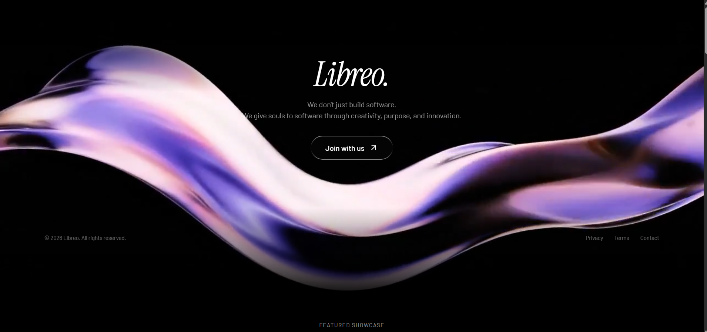

 
 

# Libreo

  <strong>We are a student community that gives souls to software.</strong> 
  <em>Building meaningful projects with creativity, purpose, and passion.</em>

---

###  About Libreo

> *"Software isn't just code and pixels — it's an art form, an experience, and an extension of human imagination."*

Libreo is a collective of passionate student developers, designers, and creators who believe in crafting software that breathes with personality, elegance, and purpose. We focus on building high-impact digital experiences, open-source tools, and cinematic web platforms that inspire.

###  What We Value

**Soulful Craftsmanship**
Designing interfaces and architectures with meticulous attention to detail, motion, and aesthetics.

**Student-Driven Innovation**
Empowering students to experiment boldly, learn by building, and push technological boundaries.

**Creativity & Passion**
Combining artistic storytelling with state-of-the-art engineering.

**Open Collaboration**
Sharing knowledge, open-sourcing our work, and growing together as a community.

---

Crafted with heart by the <strong>Libreo Community</strong>.

